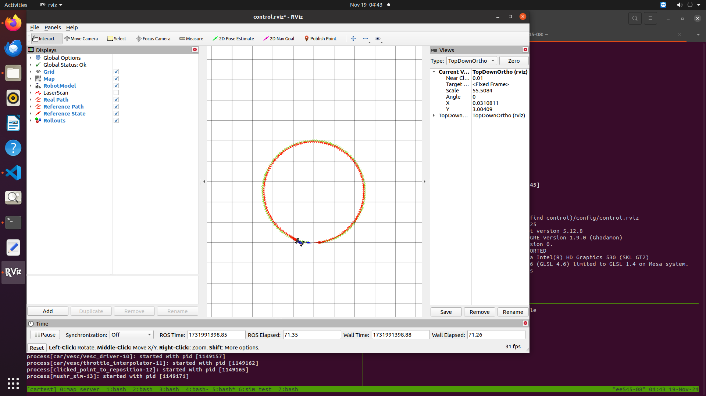
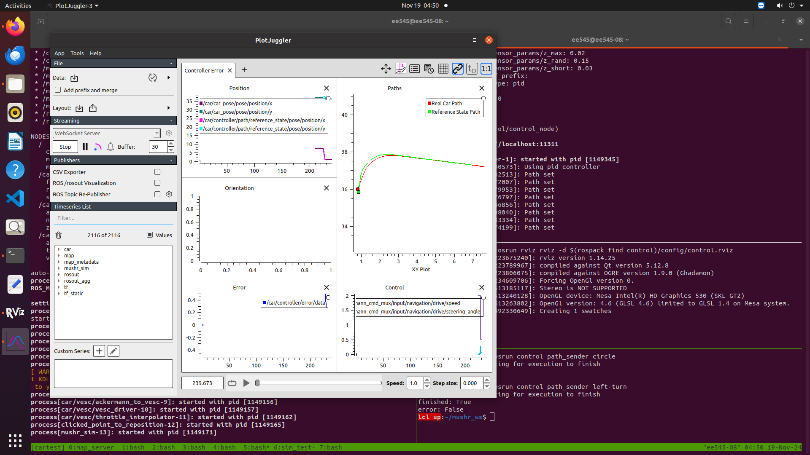
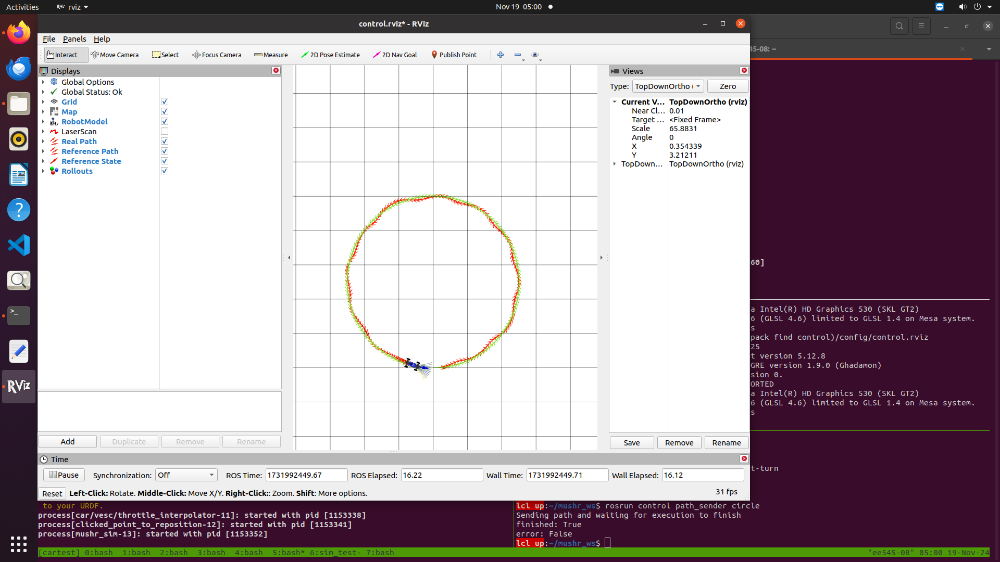

# Project 3: Control

### 1. What tradeoffs did varying the Kp gain have on your PD controller's performance? 

- Higher Kp increases responsiveness, allowing faster error correction. 
- However, there is an increased likelihood of overshoot - it risks causing oscillations or instability, especially on curved paths, therefore reducing the accuracy of the control system.

- Lower Kp improves stability and reduces overshoot, providing a smoother response. 
- But it makes the system slower to respond to errors and may struggle with rapid path changes.

With the right value of Kd in conjunction with Kp, we observed that overshoots and oscillations can be mitigated.

### 2. Describe the tuning process for your PD controller. Justify your final gains Kp,Kd and include the controller plots for three reference paths on the default **sandbox** map.
   
- We initially wanted to explore how varying the Kp value would help correct for initial errors.

- **Step 1** - When we set **Kp=1.5, Kd=0.5**, this setup shows good performance for tracking in straight-line segments. However, it underperforms on curving or wave-like paths as there was aggressive correction and overshooting. 

- **Step 2** - We then reduced Kp and changed it to **Kp=0.7, Kd=0.5** which provided a balance between steady-state error correction and stability for different kind of paths - circles, turns and straight paths.

- **Step 3** - We then fine-tuned Kd and changed it to **Kp=0.7, Kd=0.45** which reduced damping oscillations even quicker. It is likely the best setup, providing adequate damping to maintain stability while being responsive enough to follow the routes accurately. 

The controller plots for this gain settings are shown below:

   
pid_circle.png
  
     
pid_left.png
  
   
pid_wave.png
  

The plotjuggler plots are below:

   
pid_circle.png
  
     
pid_left.png
  
   
pid_wave.png
  

### 3. Describe the lookahead distance tuning process for your Pure Pursuit controller. Justify your final lookahead distance by including the controller plot for the **wave** reference path on the default **sandbox** map.

- At a lookahead distance of 0.1, the controller had two main problems:
   - It struggled to handle oscillations well due to frequent, abrupt steering adjustments in wavy paths. 
   - It focused on frequent adjustments that ensured that even though it responded quicker to immediate path deviations, it was highly unstable when the motion is supposed to be smooth.

- When we adjusted the lookahead distance to a value of 2, there were problems as well: 
   - We observed that the robot's actual trajectory diverged more significantly from the reference path.
   - Larger lookahead distances caused the robot to ignore fine path details, over-prioritizing smoothness over precision.

- When we set a lookahead distance of 1, we achieved the best balance between path tracking accuracy and smoothness.

Here is the output of the wave path:

 
pp_wave.png
 

### 4. Include controller plots on the wave path for cases where the lookahead distance is too small/large(**pp small.png, pp large.png**). Explain the resulting Pure Pursuit behavior.   

**Smaller lookahead**

- As explained above, there is a major focus on frequent adjustments.
- Even though it responded quicker to immediate path deviations, it was highly unstable when the motion is supposed to be smooth.
- This high reactivity leads to poor stability - a smooth motion is more desirable in a wave-like path as seen above for efficient and steady progress. 

**Larger lookahead**

- Larger lookahead distances caused the robot to ignore fine path details, over-prioritizing smoothness over precision.
- The resulting trajectory appears overly smoothed, deviating significantly from the intended path. 

       
   
### 5. How does varying the radius of the **circle** path affect the robustness of the Pure Pursuit controller?  
   
**Larger radii**

- Larger radii require smoother, less frequent corrections, that the pure pursuit controller can efficiently achieve.
- The lookahead distance can comfortably align with the circular path.

**Smaller radii**

- Smaller radii challenge the pure pursuit controller’s stability and accuracy due to the need for sharper adjustments because of their increased curvature.
- If the lookahead distance is relatively large compared to the radius, the robot can tend to fail to stay on the circle.

### 6. Describe the tuning process for the MPC optimization parameters. Justify your final parameters K, T by including the controller plots for the **circle**, **wave**, and **saw** reference paths on the default **sandbox** map. What makes the saw path so difficult to track?

- At the initial value of **K=2, T=1** we had only one next step in time to plan and choose from 2 control sequences:
   - Lower K meant limited resolution for optimization for the controller.
   - A very low T meant that the robot was limited to focus only on immediate path points, thereby inducing instability.
- When we changed the values to much higher values of **K=25, T=20** 
   - The controller was becoming overly sensitive to some micro-corrections, causing the turns that were chosen to be minimal cost paths to still end up colliding with the obstacle at times.
   - Very high T value meant that we were over-prioritizing distant path points, and that we needed a balance in tuning.
   - Computational load increased significantly due to very high K and T values, slowing down the system's response.
- Our final values that worked were: **K=12, T=15** 
   - Increasing K to 12 provided sufficient control sequence diversity to handle complex paths.
   - A horizon of 15 allowed the controller to anticipate future path changes effectively.

The controller plots are shown below:

   
mpc_circle.png
  
     
mpc_wave.png
  
   
mpc_saw.png
  

**Saw path's difficulty**
- The saw path contains frequent, abrupt transitions in direction, requiring the robot to make sharp, precise corrections.
- At higher speeds, the robot struggles to react to these quick changes,
- Shorter prediction horizons fail to anticipate these changes, causing the robot to lag behind the path and take its time to course correct, as we can see in the image above.

### 7. Include controller plots for two reference paths and slaloms of your choice in the **slalom_world** map.

The controller plots are shown below:

   
mpc_line-slalom-1.png
  
     
mpc_left-turn-slalom-2.png

### 8. In this project, we asked you to implement a very specific MPC cost function that only includes distance and collision terms (and specific weights for the two terms). What other terms might you include, if you were to customize your cost function? (You don't have to implement this, just describe some ideas.)

We could try the following:

- We can penalize deviations from the velocity to ensure that the robot can maintain a smooth, consistent speed for certain paths that may prioritize time, smoothness and consistency in execution.
- We can penalize the steering angle changes to minimize abrupt steering inputs, that can also lead to smoother trajectories.
- We can penalize excessive time taken to complete a trajectory.
- We can penalize misalignment with the desired orientation at the goal in some use-cases.

### 9. Of your three tuned controllers, in which settings is each controller most robust? Which controller worked best in high-speed regimes? You can set the desired speed by adding the **--speed <SPEED>** flag to **path sender**.
  
PID controller:
- Robust in simple, well-structured low-curvature paths with minimal and moderate speed.
- It struggles with sharp turns and high curvatures.

PP controller:
- Highly robust at high speeds, especially on smooth and gradual paths such as large-radius curves.
- It is the best-performing controller in a high-speed environment, because:  
   - The lookahead mechanism ensures smooth and anticipatory adjustments.
   - Does not rely on fine-grained reactive control, making it less susceptible to high-speed instabilities.
- It is more reliable than PID on winding paths because it continually adjusts its target (lookahead distance).  
   

MPC controller:
- MPC is highly robust in dynamic and complex settings in moderate speed due to its predictive nature and optimization capabilities. 
- It handles sharp turns, dynamic obstacles, and environmental uncertainties better because it predicts trajectories over a planning horizon.
- It is very good in environments where computation complexity does not hinder real-time performance.
- It is scalable to a wide range of practical use-cases because we can tailor the cost function to account for multiple constraints.
   
Here are the outputs of circular path in high speeds for all 3 controllers:

    
mpc_high-speed-consistent.png
  
    
pid_high-speed-consistent.png
  
    
pp_high-speed-consistent.png
 

### 10. Record a video of your particle filter running successfully on the real robot. You should use the **small_basement** map, and the video should show your robot moving via teleoperation around the basement. Any reasonable submission for this question will be accepted, as long as we can reasonably see the localization capabilities of your system.

Bag file:
- particle_filter.bag

**Particle filter**

<video controls src="particle_filter.mp4" title="Particle filter working on the robot"></video>

Please refer to particle_filter.mp4 in the same writeup folder.

### 11. Record a video and a screenshot of rviz for each controller (**pid**, **pp** and **mpc**) running on the real car.

Bag files:
- pid.bag
- pp.bag
- mpc.bag

Screenshots:

**PID rviz**

    
pid_rviz.png
 

**PP rviz** 
    
pp_rviz.png
 

**MPC rviz**
    
mpc_rviz.png
 

Note - we relocated the car (using 2d pose estimate) after generating the MPC plot before taking the screenshot and that is why the location is different.

Videos:

**PID controller**

   <video controls src="pid.mp4" title="PID controller working on the robot"></video>

   Please refer to particle_filpidter.mp4 in the same writeup folder.

**PP controller**

   <video controls src="pp.mp4" title="PP controller working on the robot"></video>

   Please refer to pp.mp4 in the same writeup folder.

**MPC controller**

   <video controls src="mpc.mp4" title="MPC controller working on the robot"></video>

   Please refer to mpc.mp4 in the same writeup folder.

