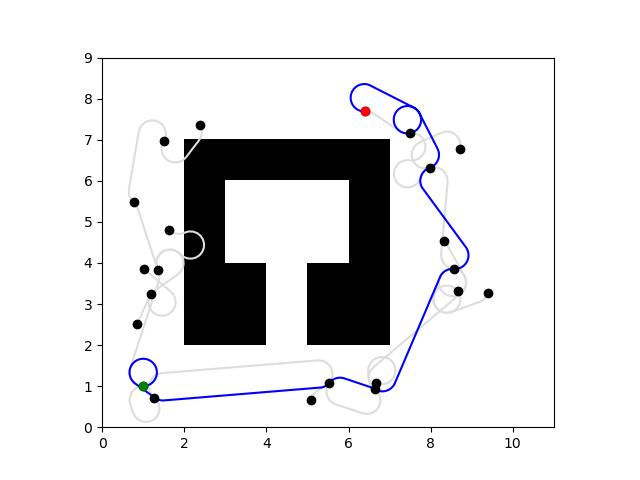
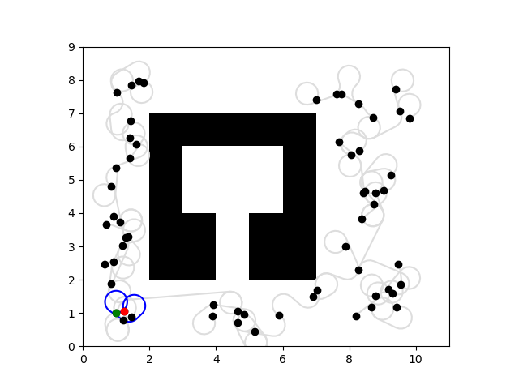
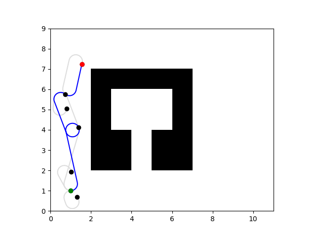
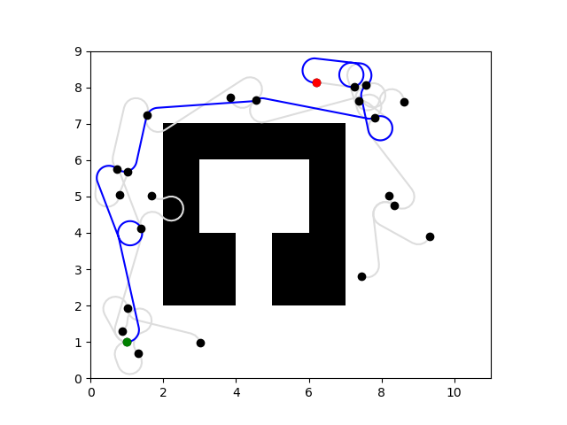

# Project 4: Planning 

## Bonus part Q5.1 

rrt_se2_eta0.5_b0.05.png

## Bonus part Q5.2
**a. Impact of η (Step Size)**    

**Smaller η (e.g., η = 0.4):**  
Effect: Results in finer exploration, making it suitable for constrained environments like narrow passages.   
Drawback: Slower convergence, as the tree requires more iterations to cover the space and reach the goal.   

rrt_se2_max1000_eta0.4_b0.05.png   

**Larger η (e.g., η = 0.55):**  
Effect: Accelerates tree growth and better covers open spaces.  
Drawback: Overshooting becomes more common, reducing precision near the goal, especially in environments with obstacles.  
  

rrt_se2_max1000_eta0.55_b0.05.png

**b. Impact of bias (Goal Sampling Probability)**  
**Lower bias (e.g., bias = 0.02):**  
Effect: Encourages global exploration, suitable for environments with large open spaces.  
Drawback: Slower convergence, as the tree rarely samples the goal.  
 

rrt_se2_max1000_eta0.55_b0.02.png  

**Higher bias (e.g., bias = 0.2):**  
Effect: Guides the tree more directly toward the goal, speeding up convergence.  
Drawback: Reduces global exploration, potentially leading to suboptimal paths.  
 

rrt_se2_max1000_eta0.55_b0.2.png
